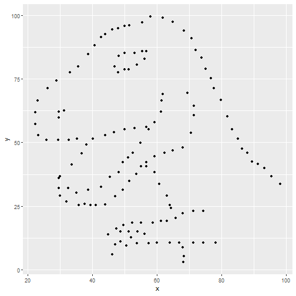
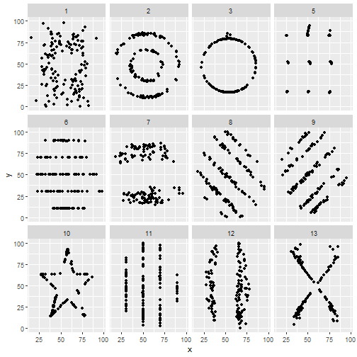
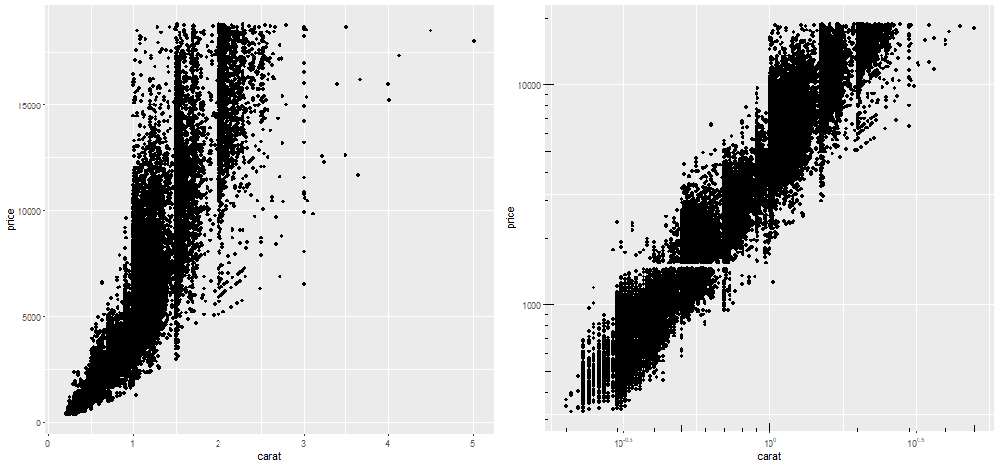
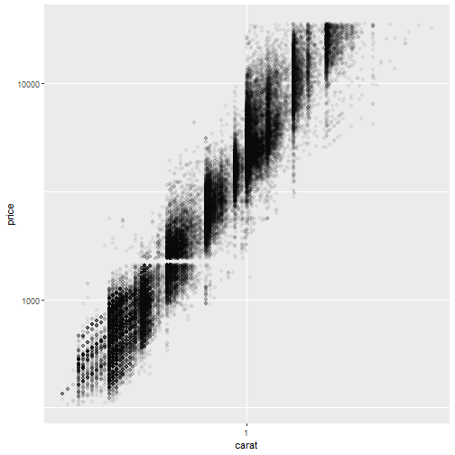
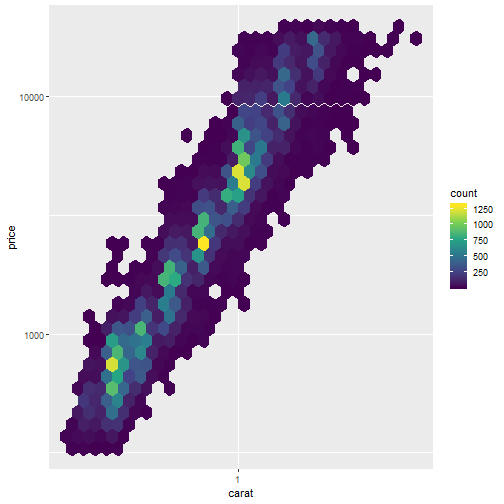

## Why visualisation?

Let's meet a dataset:


```r
data
```

```
## # A tibble: 142 x 3
##    dataset     x     y
##      <int> <dbl> <dbl>
##  1       4  55.4  97.2
##  2       4  51.5  96.0
##  3       4  46.2  94.5
##  4       4  42.8  91.4
##  5       4  40.8  88.3
##  6       4  38.7  84.9
##  7       4  35.6  79.9
##  8       4  33.1  77.6
##  9       4  29.0  74.5
## 10       4  26.2  71.4
## # ... with 132 more rows
```


Let's get an idea of its structure:


```r
summary(data)
```

```
##     dataset        x               y         
##  Min.   :4   Min.   :22.31   Min.   : 2.949  
##  1st Qu.:4   1st Qu.:44.10   1st Qu.:25.288  
##  Median :4   Median :53.33   Median :46.026  
##  Mean   :4   Mean   :54.26   Mean   :47.832  
##  3rd Qu.:4   3rd Qu.:64.74   3rd Qu.:68.526  
##  Max.   :4   Max.   :98.21   Max.   :99.487
```

One little scatterplot:



Some more examples of why data visualisation is so valuable:

[The datasaur dozen](https://www.autodeskresearch.com/publications/samestats]. ) group of 12 two-dimensional datasets that have identical:

* mean in both dimensions
* sd in both dimensions
* correlation between x and y


**But...**

&nbsp;

&nbsp;

&nbsp;

&nbsp;




&nbsp;

&nbsp;

&nbsp;

&nbsp;


## The roles of data visualisation 

In general there are two purposes behind data visualisations:

* As a discovery tool, to explore a dataset
* As a storytelling tool, to highlight features of a dataset

&nbsp;

&nbsp;

> In both cases, successful visualisation will 
> illuminate and aid understanding, 
> not confuse or obscure.

&nbsp;

&nbsp;

&nbsp;

&nbsp;

&nbsp;

&nbsp;

&nbsp;

&nbsp;

&nbsp;

## Exercise - What is a data visualisation?

What is the difference between panel E and the other panels in the following figure?


&nbsp;

&nbsp;

&nbsp;

&nbsp;

&nbsp;

## Straight to a classic

&nbsp;


### Exercise:

- What are the data elements contributing to this plot?
- How are they each visually represented?


&nbsp;

&nbsp;

&nbsp;

&nbsp;

&nbsp;

## A modern example


### Exercise:

- How are the data elements linked to visual elements?

&nbsp;

&nbsp;

&nbsp;

&nbsp;

&nbsp;

## Another example


### Exercise:

Compare the two plots above
- How are the data elements linked to the visual elements?
- What is the difference between the two?

&nbsp;

&nbsp;

&nbsp;

## Considerations for quality graphs:

### Ink to information ratio

Compare the amount of ink used with the amount of information communicated. A high ink:information can indicate a plot that hasn't been thought through, and is often distracting or confusing. 

These plots often contain 'chart junk' (Edward Tufte).


&nbsp;


## Exercise

Compare the above figure. 
- Which elements are removed in the left version?
- Which elements could still be removed? What is their purpose?


&nbsp;

&nbsp;

&nbsp;

## Some common errors in visualisation


### Overplotting

When there are too many data points...


&nbsp;

&nbsp;

&nbsp;

## Exercise

- What are some possible solutions to overplotting?


&nbsp;

&nbsp;

&nbsp;


&nbsp;

&nbsp;

&nbsp;

### Transparency



### Binning



### Jittering


